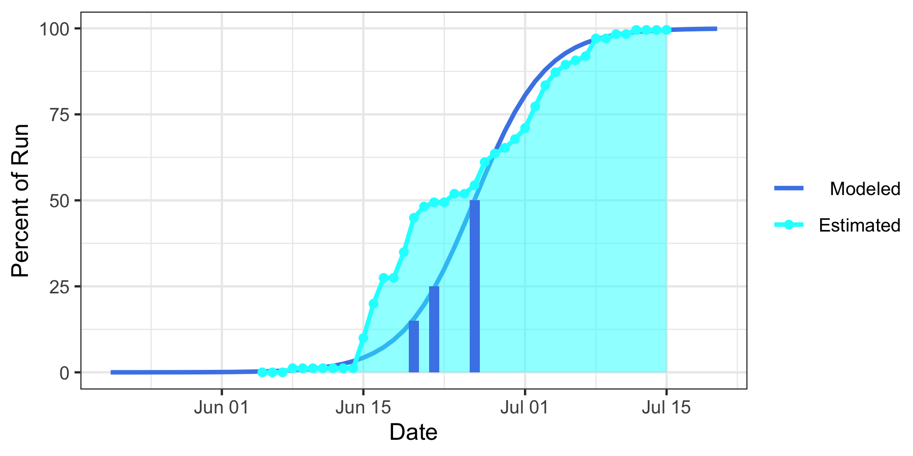
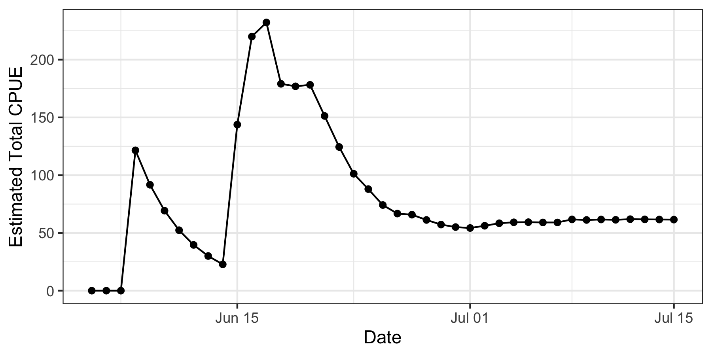

# 2023 Yukon River Chinook Run Timing Forecast

Data, code, and output for the 2023 operational forecast of Yukon River Chinook salmon run timing.

See our [AOOS Project Page](https://aoos.org/project/yukon-river-chinook-run-timing/).

## 2023 Forecast

| Percentile | Day of June |
|------------|-------------|
| 15         | 20          |
| 25         | 22          |
| 50         | 26          |

### Chart 1

### Chart 2

More detail available at in the [pre-season-forecast](https://github.com/yukon-forecasting/2023-forecast/tree/main/pre-season-forecast) folder.

## Past Years

I'm slowly migrating old repositories under [this organization](https://github.com/yukon-forecasting) but not all have made the jump yet.

- https://github.com/yukon-forecasting/2022-forecast
- https://github.com/yukon-forecasting/2021-forecast
- https://github.com/amoeba/2020-yukon-forecasting
- https://github.com/amoeba/2019-yukon-forecasting
- https://github.com/amoeba/2018-yukon-forecasting
- https://github.com/amoeba/2017-yukon-forecasting
- https://github.com/amoeba/2016-yukon-forecasting
