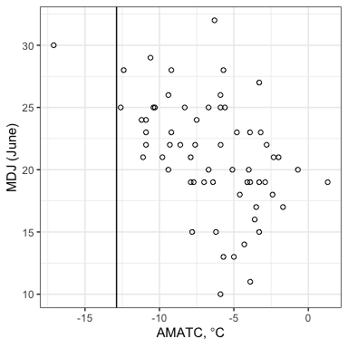
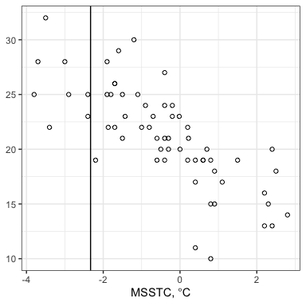
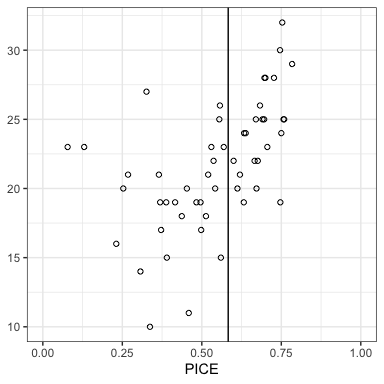
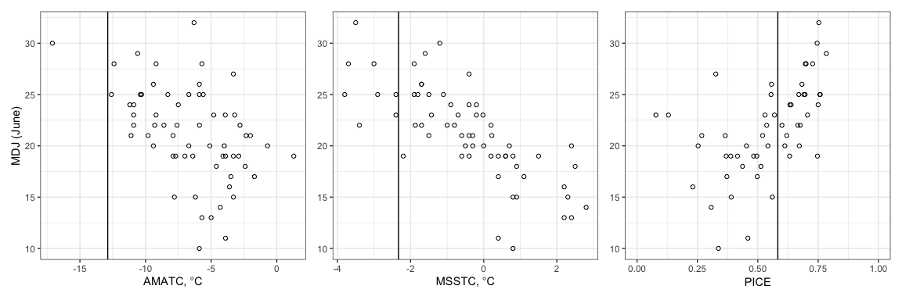
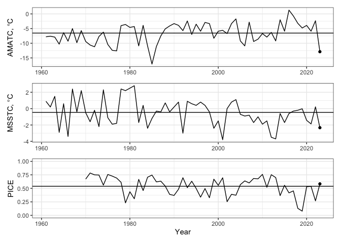
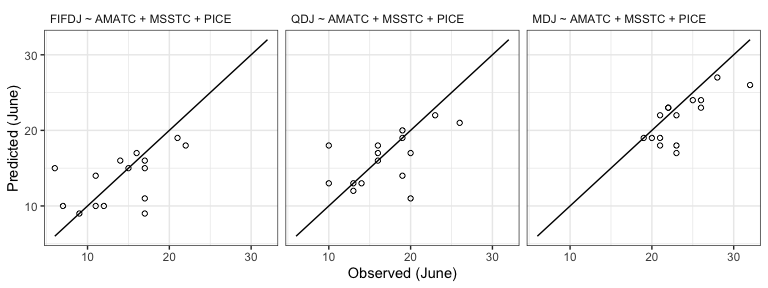
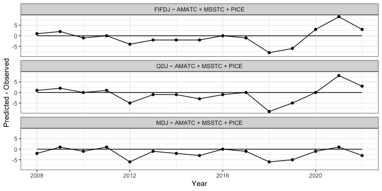
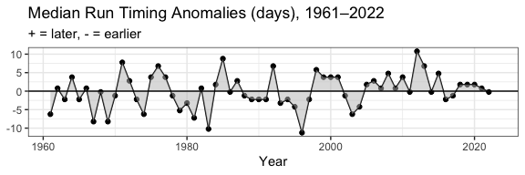

2023 Pre-Season Forecast
================

``` r
library(knitr)
library(dplyr)
library(ggplot2)
library(readr)
library(patchwork)
library(ggtext)
```

``` r
forecast_year <- 2023
suppressWarnings({
  dir.create("./figures")
  dir.create("./output")
})
theme_set(theme_bw())
```

## Data

``` r
environment <- read_csv("../../data/data/environment/environment.csv")
```

    ## Rows: 63 Columns: 4
    ## ── Column specification ────────────────────────────────────────────────────────
    ## Delimiter: ","
    ## dbl (4): year, amatc, pice, msstc
    ## 
    ## ℹ Use `spec()` to retrieve the full column specification for this data.
    ## ℹ Specify the column types or set `show_col_types = FALSE` to quiet this message.

``` r
cpue <- read_csv("../../data/data/cpue/cpue.csv")
```

    ## Rows: 62 Columns: 5
    ## ── Column specification ────────────────────────────────────────────────────────
    ## Delimiter: ","
    ## chr (1): source
    ## dbl (4): year, fifdj, qdj, mdj
    ## 
    ## ℹ Use `spec()` to retrieve the full column specification for this data.
    ## ℹ Specify the column types or set `show_col_types = FALSE` to quiet this message.

``` r
yukon <- left_join(environment, cpue)
```

    ## Joining with `by = join_by(year)`

## Figures

### MDJ vs. AMATC

``` r
p_amatc <- ggplot(yukon, aes(amatc, mdj)) +
  geom_point(shape = 1) +
  geom_vline(xintercept = yukon[which(yukon$year == forecast_year), "amatc"][[1]]) +
  labs(x = expression("AMATC," * ~ degree * "C"), y = "MDJ (June)")

p_amatc
```

<!-- -->

``` r
ggsave("./figures/mdj_against_amatc.png", width = 4, height = 4)
```

### MDJ vs. MSSTC

``` r
p_msstc <- ggplot(yukon, aes(msstc, mdj)) +
  geom_point(shape = 1) +
  geom_vline(xintercept = yukon[which(yukon$year == forecast_year), "msstc"][[1]]) +
  labs(x = expression("MSSTC," * ~ degree * "C"), y = NULL)

p_msstc
```

<!-- -->

``` r
ggsave("./figures/mdj_against_msstc.png", width = 4, height = 4)
```

### MDJ vs. PICE

``` r
p_pice <- ggplot(yukon, aes(pice, mdj)) +
  geom_point(shape = 1) +
  geom_vline(xintercept = yukon[which(yukon$year == forecast_year), "pice"][[1]]) +
  scale_x_continuous(limits = c(0, 1.0)) +
  labs(
    x = "PICE",
    y = NULL)

p_pice
```

<!-- -->

``` r
ggsave("./figures/mdj_against_pice.png", width = 4, height = 4)
```

### Combined

``` r
p_all <- p_amatc + p_msstc + p_pice
p_all
```

    ## Warning: Removed 1 rows containing missing values (`geom_point()`).
    ## Removed 1 rows containing missing values (`geom_point()`).

    ## Warning: Removed 10 rows containing missing values (`geom_point()`).

<!-- -->

``` r
ggsave("./figures/three_panel.png", width = 9, height = 3)
```

    ## Warning: Removed 1 rows containing missing values (`geom_point()`).

    ## Warning: Removed 1 rows containing missing values (`geom_point()`).

    ## Warning: Removed 10 rows containing missing values (`geom_point()`).

### Time series of AMATC, MSSTC, PICE

``` r
p1 <- ggplot(yukon, aes(year, amatc)) +
  geom_line() +
  geom_point(data = subset(yukon, year == forecast_year)) +
  geom_hline(yintercept = mean(yukon[yukon$year < forecast_year, "amatc"][[1]])) +
  labs(y = expression("AMATC," * ~ degree * "C")) +
  theme(axis.title.x = element_blank())

p2 <- ggplot(yukon, aes(year, msstc)) +
  geom_line() +
  geom_point(data = subset(yukon, year == forecast_year)) +
  geom_hline(yintercept = mean(yukon[yukon$year < forecast_year, "msstc"][[1]])) +
  labs(y = expression("MSSTC," * ~ degree * "C")) +
  theme(axis.title.x = element_blank())

p3 <- ggplot(yukon, aes(year, pice)) +
  geom_line() +
  geom_point(data = subset(yukon, year == forecast_year)) +
  geom_hline(yintercept = mean(yukon[yukon$year < forecast_year, "pice"][[1]], na.rm = TRUE)) +
  scale_y_continuous(limits = c(0, 1)) +
  labs(
    x = "Year",
    y = "PICE"
  )
timeseries_3p <- p1 / p2 / p3
timeseries_3p
```

<!-- -->

``` r
ggsave("./figures/timseries_3p.png", timeseries_3p, width = 8, height = 6)
```

## Modeling

### Model Selection

``` r
models <- c(
  "mdj ~ amatc",
  "mdj ~ msstc",
  "mdj ~ pice",
  "mdj ~ amatc + msstc",
  "mdj ~ amatc + pice",
  "mdj ~ msstc + pice",
  "mdj ~ amatc + msstc + pice"
)
models
```

    ## [1] "mdj ~ amatc"                "mdj ~ msstc"               
    ## [3] "mdj ~ pice"                 "mdj ~ amatc + msstc"       
    ## [5] "mdj ~ amatc + pice"         "mdj ~ msstc + pice"        
    ## [7] "mdj ~ amatc + msstc + pice"

# Set up selection

``` r
hindcast_window <- 15 # last n years
hindcast_years <- seq(forecast_year - hindcast_window, forecast_year - 1)
round_method <- floor # Floor predictions

hindcast_year <- function(data, model, forecast_year) {
  training_data <- data[data$year < forecast_year, ]
  training_model <- lm(formula(model), training_data)

  new_data <- data[data$year == forecast_year, ]
  prediction <- predict(training_model, newdata = new_data, se.fit = TRUE)
  prediction_fit <- round_method(prediction$fit[[1]])
  prediction_interval <- prediction_fit + c(-2, 2) * qnorm(0.975) *
    prediction$se.fit[[1]]

  # Extract response
  response_var = dimnames(attr(terms(as.formula(model)), "factors"))[[1]][1]
  actual <- new_data[[response_var]]

  in_interval <- actual >= round_method(prediction_interval[1]) &&
    actual <= round_method(prediction_interval[2])

  data.frame(
    "formula" = model,
    "year" = forecast_year,
    "predicted" = (prediction_fit),
    "observed" = actual,
    "diff" = prediction_fit - actual,
    "predict_se" = prediction$se.fit[[1]],
    "in_interval" = in_interval,
    "int_lower" = prediction_interval[1],
    "int_upper" = prediction_interval[2],
    "int_width" = prediction_interval[2] -
      prediction_interval[1]
  )
}

hindcast_model <- function(data, model, years, summarize = TRUE) {
  result <- lapply(years, function(year) {
    hindcast_year(data, model, year)
  })

  model_result <- do.call(rbind, result)

  if (!summarize) {
    return(model_result)
  }

  data.frame(
    model = model,
    "MAPE" = round(mean(abs(model_result$predicted - model_result$observed)), 2),
    "SDMAPE" = round(sd(abs(model_result$predicted - model_result$observed)), 2),
    "width" = round(mean(model_result$int_width), 2),
    "p.in" = round(sum(model_result$in_interval) / length(model_result$in_interval), 2),
    "absmax" = max(abs(model_result$predicted - model_result$observed)),
    "meanbias" = round(mean(model_result$predicted - model_result$observed), 2)
  )
}

hindcast_models <- function(data, models, years) {
  result <- lapply(models, function(model) {
    hindcast_model(data, model, years)
  })

  do.call(rbind, result)
}

model_selection_result <- hindcast_models(yukon, models, hindcast_years)
knitr::kable(model_selection_result)
```

| model                       | MAPE | SDMAPE | width | p.in | absmax | meanbias |
|:----------------------------|-----:|-------:|------:|-----:|-------:|---------:|
| mdj \~ amatc                | 4.40 |   2.72 |  6.05 | 0.40 |     12 |    -4.40 |
| mdj \~ msstc                | 1.73 |   1.53 |  4.42 | 0.60 |      5 |    -0.93 |
| mdj \~ pice                 | 3.73 |   3.45 |  6.73 | 0.60 |     11 |    -3.60 |
| mdj \~ amatc + msstc        | 2.40 |   1.72 |  5.77 | 0.60 |      7 |    -2.00 |
| mdj \~ amatc + pice         | 4.07 |   3.03 |  8.03 | 0.40 |     10 |    -3.93 |
| mdj \~ msstc + pice         | 2.27 |   2.19 |  7.03 | 0.80 |      7 |    -1.60 |
| mdj \~ amatc + msstc + pice | 2.27 |   1.94 |  8.01 | 0.87 |      6 |    -1.87 |

``` r
write.csv(model_selection_result, file = "./output/model_select.csv")
```

### 15%

``` r
model_fifdj <- lm(fifdj ~ amatc + msstc + pice, data = subset(yukon, year < forecast_year))
summary(model_fifdj)
```

    ## 
    ## Call:
    ## lm(formula = fifdj ~ amatc + msstc + pice, data = subset(yukon, 
    ##     year < forecast_year))
    ## 
    ## Residuals:
    ##     Min      1Q  Median      3Q     Max 
    ## -9.3975 -1.8698  0.4948  2.1181  6.7913 
    ## 
    ## Coefficients:
    ##             Estimate Std. Error t value Pr(>|t|)    
    ## (Intercept)   9.1929     1.7281   5.320 2.56e-06 ***
    ## amatc        -0.6380     0.1753  -3.640 0.000656 ***
    ## msstc        -1.3958     0.3726  -3.746 0.000473 ***
    ## pice         -0.3045     3.9859  -0.076 0.939416    
    ## ---
    ## Signif. codes:  0 '***' 0.001 '**' 0.01 '*' 0.05 '.' 0.1 ' ' 1
    ## 
    ## Residual standard error: 3.382 on 49 degrees of freedom
    ##   (9 observations deleted due to missingness)
    ## Multiple R-squared:  0.5597, Adjusted R-squared:  0.5327 
    ## F-statistic: 20.76 on 3 and 49 DF,  p-value: 8.072e-09

``` r
prediction_fifdj <- floor(predict(model_fifdj, newdata = yukon[yukon$year == forecast_year, ]))
```

### 25%

``` r
model_qdj <- lm(qdj ~ amatc + msstc + pice, data = subset(yukon, year < forecast_year))
summary(model_qdj)
```

    ## 
    ## Call:
    ## lm(formula = qdj ~ amatc + msstc + pice, data = subset(yukon, 
    ##     year < forecast_year))
    ## 
    ## Residuals:
    ##    Min     1Q Median     3Q    Max 
    ## -8.245 -1.722  0.118  1.526  6.553 
    ## 
    ## Coefficients:
    ##             Estimate Std. Error t value Pr(>|t|)    
    ## (Intercept)  11.9573     1.6158   7.400 1.59e-09 ***
    ## amatc        -0.5338     0.1639  -3.257  0.00205 ** 
    ## msstc        -1.6054     0.3484  -4.609 2.92e-05 ***
    ## pice          0.2634     3.7268   0.071  0.94394    
    ## ---
    ## Signif. codes:  0 '***' 0.001 '**' 0.01 '*' 0.05 '.' 0.1 ' ' 1
    ## 
    ## Residual standard error: 3.162 on 49 degrees of freedom
    ##   (9 observations deleted due to missingness)
    ## Multiple R-squared:  0.5979, Adjusted R-squared:  0.5733 
    ## F-statistic: 24.28 on 3 and 49 DF,  p-value: 9.004e-10

``` r
prediction_qdj <- floor(predict(model_qdj, newdata = yukon[yukon$year == forecast_year, ]))
```

### 50%

``` r
model_mdj <- lm(mdj ~ amatc + msstc + pice, data = subset(yukon, year < forecast_year))
summary(model_mdj)
```

    ## 
    ## Call:
    ## lm(formula = mdj ~ amatc + msstc + pice, data = subset(yukon, 
    ##     year < forecast_year))
    ## 
    ## Residuals:
    ##     Min      1Q  Median      3Q     Max 
    ## -8.8853 -1.2282  0.2582  1.7076  6.6086 
    ## 
    ## Coefficients:
    ##             Estimate Std. Error t value Pr(>|t|)    
    ## (Intercept)  18.5716     1.5223  12.200  < 2e-16 ***
    ## amatc        -0.2879     0.1544  -1.865   0.0682 .  
    ## msstc        -1.8822     0.3282  -5.735 5.98e-07 ***
    ## pice          0.3582     3.5112   0.102   0.9192    
    ## ---
    ## Signif. codes:  0 '***' 0.001 '**' 0.01 '*' 0.05 '.' 0.1 ' ' 1
    ## 
    ## Residual standard error: 2.979 on 49 degrees of freedom
    ##   (9 observations deleted due to missingness)
    ## Multiple R-squared:  0.5951, Adjusted R-squared:  0.5703 
    ## F-statistic: 24.01 on 3 and 49 DF,  p-value: 1.062e-09

``` r
prediction_mdj <- floor(predict(model_mdj, newdata = yukon[yukon$year == forecast_year, ]))
```

``` r
predictions <- data.frame(
  percentile = c("fifdj", "qdj", "mdj"),
  prediction = as.integer(c(
    prediction_fifdj,
    prediction_qdj,
    prediction_mdj
  ))
)
write_csv(predictions, file = "./output/predictions.csv")
kable(predictions)
```

| percentile | prediction |
|:-----------|-----------:|
| fifdj      |         20 |
| qdj        |         22 |
| mdj        |         26 |

# Historical Comparisons

## Long Term Means

``` r
long_term_means <- data.frame(
  variable = c("AMATC", "MSSTC", "PICE", "FIFDJ", "QDJ", "MDJ"),
  current_year_value = c(
    mean(yukon$amatc[which(yukon$year == forecast_year)]),
    mean(yukon$msstc[which(yukon$year == forecast_year)]),
    mean(yukon$pice[which(yukon$year == forecast_year)], na.rm = TRUE),
    mean(yukon$fifdj[which(yukon$year == forecast_year)]),
    mean(yukon$qdj[which(yukon$year == forecast_year)]),
    mean(yukon$mdj[which(yukon$year == forecast_year)])

  ),
  long_term_mean = c(
    mean(yukon$amatc[which(yukon$year < forecast_year)]),
    mean(yukon$msstc[which(yukon$year < forecast_year)]),
    mean(yukon$pice[which(yukon$year < forecast_year)], na.rm = TRUE),
    mean(yukon$fifdj[which(yukon$year < forecast_year)]),
    mean(yukon$qdj[which(yukon$year < forecast_year)]),
    mean(yukon$mdj[which(yukon$year < forecast_year)])

  )
)
long_term_means$cur_minus_ltm <- long_term_means$current_year_value - long_term_means$long_term_mean
long_term_means$range <- c(
  paste(range(yukon$amatc[which(yukon$year < forecast_year)]), collapse = " to "),
  paste(range(yukon$msstc[which(yukon$year < forecast_year)]), collapse = " to "),
  paste(range(yukon$pice[which(yukon$year < forecast_year)], na.rm = TRUE), collapse = " to "),
  paste(range(yukon$fifdj[which(yukon$year < forecast_year)]), collapse = " to "),
  paste(range(yukon$qdj[which(yukon$year < forecast_year)]), collapse = " to "),
  paste(range(yukon$mdj[which(yukon$year < forecast_year)]), collapse = " to ")

)
kable(long_term_means)
```

| variable | current_year_value | long_term_mean | cur_minus_ltm | range          |
|:---------|-------------------:|---------------:|--------------:|:---------------|
| AMATC    |            -12.880 |     -6.5361290 |    -6.3438710 | -17.1 to 1.3   |
| MSSTC    |             -2.330 |     -0.4612742 |    -1.8687258 | -3.8 to 2.8    |
| PICE     |              0.583 |      0.5387547 |     0.0442453 | 0.078 to 0.784 |
| FIFDJ    |                 NA |     13.7580645 |            NA | 5 to 23        |
| QDJ      |                 NA |     16.1451613 |            NA | 6 to 26        |
| MDJ      |                 NA |     21.2258065 |            NA | 10 to 32       |

``` r
long_term_timing_means <- data.frame(
  fifdj = mean(yukon$fifdj, na.rm = TRUE),
  qdj = mean(yukon$qdj, na.rm = TRUE),
  mdj = mean(yukon$mdj, na.rm = TRUE))
kable(long_term_timing_means)
```

|    fifdj |      qdj |      mdj |
|---------:|---------:|---------:|
| 13.75806 | 16.14516 | 21.22581 |

## Hindcast all three models

``` r
hindcast_fifdj <- hindcast_model(yukon, "fifdj ~ amatc + msstc + pice", hindcast_years)
hindcast_qdj <- hindcast_model(yukon, "qdj ~ amatc + msstc + pice", hindcast_years)
hindcast_mdj <- hindcast_model(yukon, "mdj ~ amatc + msstc + pice", hindcast_years)

hindcast_all_percentiles <- rbind(
  hindcast_fifdj,
  hindcast_qdj,
  hindcast_mdj)
write_csv(hindcast_all_percentiles, "output/hindcast_all_models.csv")
kable(hindcast_all_percentiles)
```

| model                         | MAPE | SDMAPE | width | p.in | absmax | meanbias |
|:------------------------------|-----:|-------:|------:|-----:|-------:|---------:|
| fifdj \~ amatc + msstc + pice | 2.93 |   2.74 |  8.09 | 0.87 |      9 |    -0.53 |
| qdj \~ amatc + msstc + pice   | 2.67 |   2.87 |  7.58 | 0.73 |      9 |    -0.67 |
| mdj \~ amatc + msstc + pice   | 2.27 |   1.94 |  8.01 | 0.87 |      6 |    -1.87 |

``` r
hindcast_models <- c(
  "fifdj ~ amatc + msstc + pice",
  "qdj ~ amatc + msstc + pice",
  "mdj ~ amatc + msstc + pice"
)
hindcast <- do.call(rbind, lapply(hindcast_models, function(model) {
  hindcast_model(yukon, model, hindcast_years, summarize = FALSE)

}))

hindcast$formula <- toupper(hindcast$formula)
hindcast$formula <- ordered(hindcast$formula, c(
  "FIFDJ ~ AMATC + MSSTC + PICE",
  "QDJ ~ AMATC + MSSTC + PICE",
  "MDJ ~ AMATC + MSSTC + PICE"
))
predicted_vs_observed <- ggplot(hindcast, aes(observed, predicted)) +
  geom_point(shape = 1) +
  scale_shape_manual(values = c(1, 19)) +
  facet_wrap(~ formula) +
  annotate(
    geom = "segment",
    x = min(c(hindcast$observed, hindcast$predicted)),
    y = min(c(hindcast$observed, hindcast$predicted)),
    xend = max(c(hindcast$observed, hindcast$predicted)),
    yend = max(c(hindcast$observed, hindcast$predicted))
  ) +
  labs(
    x = "Observed (June)",
    y = "Predicted (June)"  ) +
  theme(strip.background = element_rect(fill=NA, colour=NA),
        strip.text = element_text(hjust = 0))

ggsave("figures/predicted_vs_observed.png",
  predicted_vs_observed,
  width = 8,
  height = 3
)
predicted_vs_observed
```

<!-- -->

``` r
forecast_timeseries <- ggplot(hindcast, aes(year, diff)) +
  geom_line() +
  geom_point() +
  facet_wrap(~ formula, ncol = 1) +
  annotate(geom = "segment", x = min(hindcast$year), xend = max(hindcast$year), y = 0, yend = 0) +
  labs(
    x = "Year",
    y = "Predicted - Observed"
  )
forecast_timeseries
```

<!-- -->

## Long-term summaries

### Median dates over time

``` r
yukon <- yukon %>% mutate(diff = mdj - mean(mdj, na.rm = TRUE))
ggplot(data = yukon, aes(year, diff)) +
  geom_line() +
  geom_point() +
  geom_ribbon(aes(ymin = 0, ymax = diff), fill = "gray", alpha = 0.5) +
  geom_hline(yintercept=0) +
  xlab("Year") +
  ylab(NULL) +
  ggtitle("Median Run Timing Anomalies (days), 1961–2022",
          subtitle = "+ = later, - = earlier")
```

    ## Warning: Removed 1 row containing missing values (`geom_line()`).

    ## Warning: Removed 1 rows containing missing values (`geom_point()`).

<!-- -->
